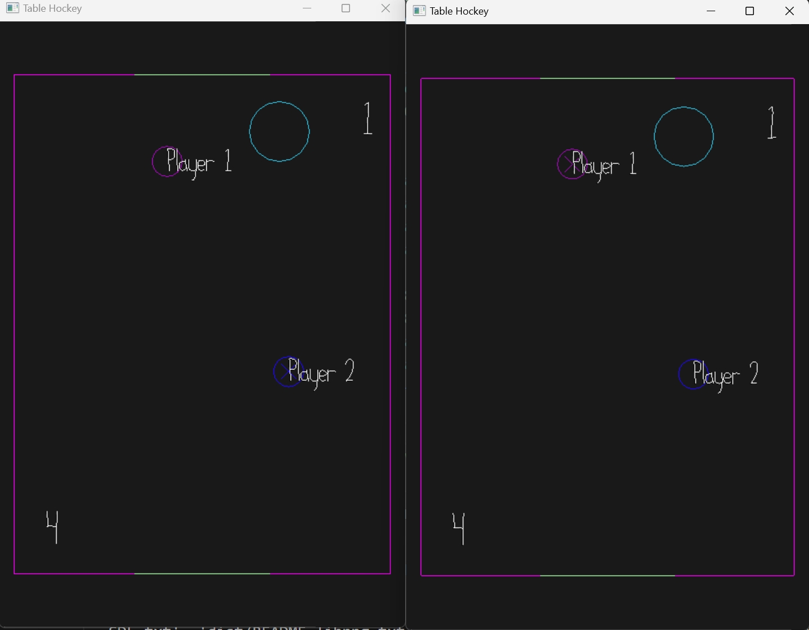

# 2 Player Table Hockey

Author: Jacky Sun

Design: 2 player table hockey, bounce the hockey into opponent's goal.
Networking: In Game.cpp, I added the logic for calculating hockey physics as well as player scores, and when sending game status I am also sending hockey's velocity, position and player scores.

Screen Shot:

How To Play:

Use WASD to control your player and try to score.

This game was built with [NEST](NEST.md).

